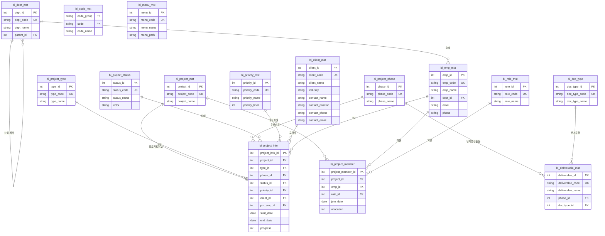

# Binary Soft 데이터베이스 ERD

## 기준정보 테이블 관계도



## 테이블 목록

| 구분 | 테이블명 | 설명 | 비고 |
|------|---------|------|------|
| 시스템 | `bi_code_mst` | 공통코드 마스터 | 코드그룹+코드 복합PK |
| 시스템 | `bi_menu_mst` | 메뉴 마스터 | 계층구조 |
| 조직 | `bi_dept_mst` | 부서 마스터 | 계층구조 |
| 조직 | `bi_role_mst` | 역할 마스터 | PM, PL, 개발자 등 |
| 조직 | `bi_emp_mst` | 직원 마스터 | 사번, 이름, 부서, 이메일, 전화 |
| 고객 | `bi_client_mst` | 고객사 마스터 | 담당자정보 통합 |
| 프로젝트 | `bi_project_type` | 프로젝트 유형 | SI, SM, 컨설팅 등 |
| 프로젝트 | `bi_project_phase` | 프로젝트 단계 | 수주→종료 |
| 프로젝트 | `bi_project_status` | 프로젝트 상태 | 색상 포함 |
| 프로젝트 | `bi_issue_type` | 이슈 유형 | 버그, 요청 등 |
| 프로젝트 | `bi_priority_mst` | 우선순위 | 긴급~낮음 |
| **프로젝트** | `bi_project_mst` | **프로젝트 마스터** | 프로젝트ID, 코드, 명 |
| **프로젝트** | `bi_project_info` | **프로젝트 정보** | FK 연결 (상세정보) |
| **프로젝트** | `bi_project_member` | **프로젝트 배정 직원** | 프로젝트-직원 다대다 |
| 문서 | `bi_doc_type` | 문서 유형 | - |
| 문서 | `bi_deliverable_mst` | 산출물 마스터 | 단계별 필수 정의 |

## 핵심 관계

```
bi_project_mst (프로젝트 마스터)
    ├── bi_project_info (1:1) - 프로젝트 상세 정보
    │       ├── bi_project_type (유형)
    │       ├── bi_project_phase (현재단계)
    │       ├── bi_project_status (상태)
    │       ├── bi_priority_mst (우선순위)
    │       ├── bi_client_mst (고객사)
    │       └── bi_emp_mst (PM)
    │
    └── bi_project_member (1:N) - 배정 직원
            ├── bi_emp_mst (직원)
            └── bi_role_mst (역할)
```

## 네이밍 규칙

- **스키마**: `binary`
- **테이블 접두어**: `bi_` (Binary의 약자)
- **마스터 테이블 접미어**: `_mst`
- **컬럼명**: snake_case
- **PK**: `{entity}_id` (SERIAL)
- **코드 컬럼**: `{entity}_code` (UK)
