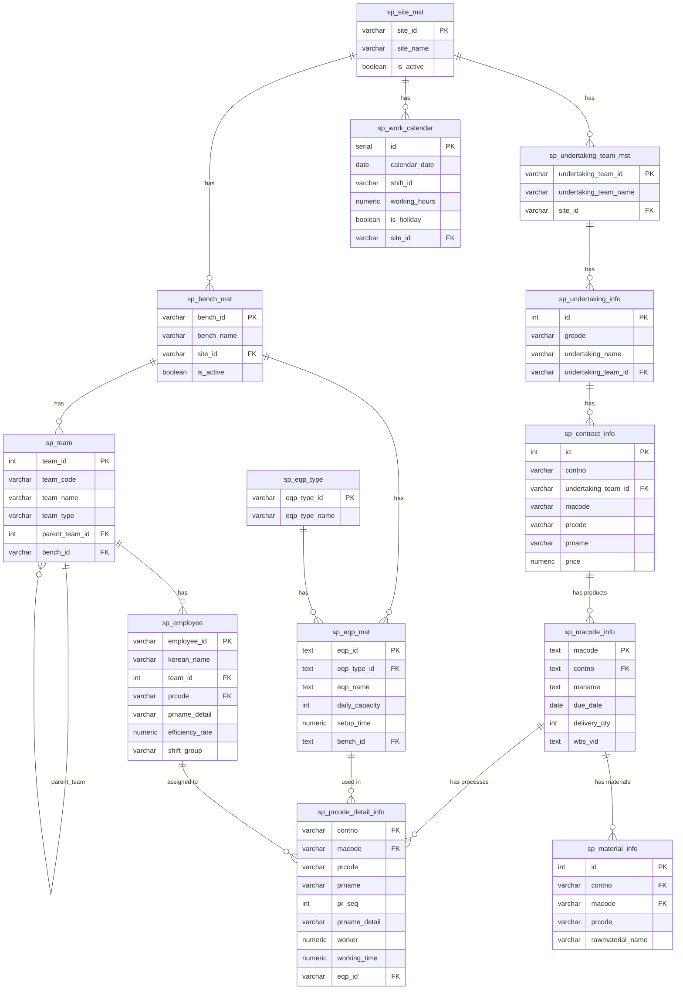

# SpacePro ER Diagram (sp_ 테이블)

> **최종 업데이트**: 2026-01-25
> **테이블 수**: 13개
> **관계 수**: 14개

## 인터랙티브 ER 다이어그램

📊 **화면 경로**: [`/master/er-diagram`](http://localhost:3002/master/er-diagram)

## 테이블 관계도

## 테이블 설명

### 조직 계층 (Site Hierarchy)
| 테이블 | 설명 | 주요 컬럼 |
|--------|------|----------|
| `sp_site_mst` | 사업장 마스터 | site_id, site_name |
| `sp_bench_mst` | 작업장 마스터 | bench_id, bench_name |
| `sp_team` | 팀/분임조 | team_id, team_name |
| `sp_employee` | 작업자 | employee_id, **prcode**, **efficiency_rate** |
| `sp_work_calendar` | 작업 캘린더 | calendar_date, shift_id, **is_holiday** |

### 사업 계층 (Business Hierarchy)
| 테이블 | 설명 | 주요 컬럼 |
|--------|------|----------|
| `sp_undertaking_team_mst` | 사업팀 마스터 | undertaking_team_id |
| `sp_undertaking_info` | 사업 정보 | undertaking_name |
| `sp_contract_info` | 계약 정보 | contno, price |
| `sp_macode_info` | 제품 정보 | macode, **due_date**, **delivery_qty** |
| `sp_prcode_detail_info` | 세부공정 | prcode, worker, working_time |
| `sp_material_info` | 자재 정보 | rawmaterial_name |

### 설비 (Equipment)
| 테이블 | 설명 | 주요 컬럼 |
|--------|------|----------|
| `sp_eqp_type` | 설비 타입 | eqp_type_id |
| `sp_eqp_mst` | 설비 마스터 | eqp_id, **daily_capacity**, **setup_time** |

## 2026-01-25 변경사항

### 신규 테이블
- `sp_work_calendar` - 작업 캘린더 (2026년 1,095건)

### 추가 컬럼 (시뮬레이션용)
- `sp_macode_info`: `due_date`, `delivery_qty`
- `sp_eqp_mst`: `daily_capacity`, `setup_time`, `availability_rate`
- `sp_employee`: `prcode`, `prname_detail`, `efficiency_rate`

### 신규 관계
- `sp_employee` → `sp_prcode_detail_info` (작업자-공정 배정)
- `sp_site_mst` → `sp_work_calendar` (사업장-캘린더)
